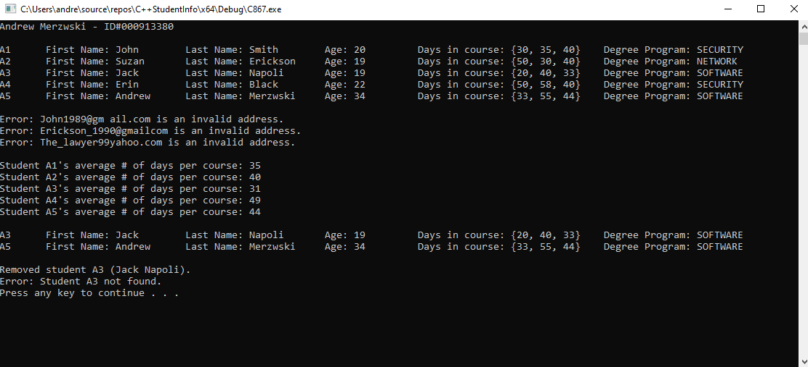

# Student Info Script

A small C++ program that displays formatted array data and performs basic data validation and deletions.

## Features:

* Display full list of students, # days spent in each of 3 courses/classes, and associated degree program

* Validate entered email address and print invalid entries

* Calculate and display average # days per course/class for each student

* Display filtered results for specific degree program 

* Remove student entity and print verification of removal

## Example

